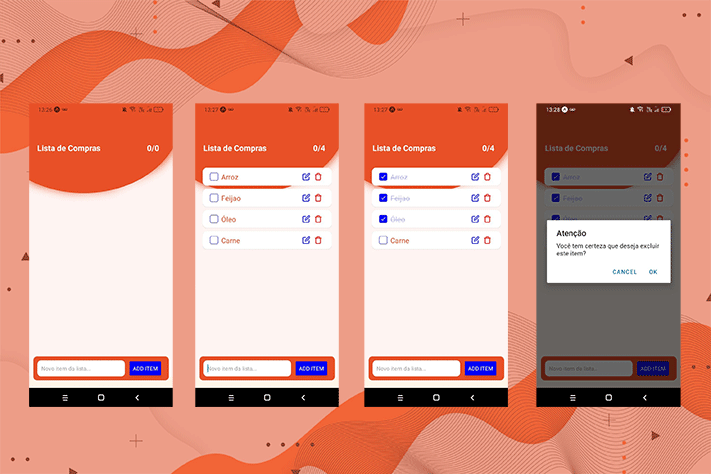

# WebList

<center>

</center>
> Aplicativo que permita o cadastro de itens em uma lista de compras para facilitar a vida do usuário quando ele vai ao mercado.


### Requisitos Obrigatórios

- [x] O app deve ser desenvolvido em React Native
- [x] O app deve possuir um campo para cadastro de novos itens na lista
- [x] O app deve contabilizar alterar os estilos do item da lista caso este item esteja selecionado
- [x] O app deve permitir a exclusão de itens da lista, sendo que é necessário confirmar com o usuário se o item pode realmente ser excluído
- [ ] O app deve apresentar a mensagem de “nenhum item na lista” caso nenhum item tenha sido adicionado.

### Requisitos Opcionais

- [x] Splash screen
- [ ] Persistir os itens da lista para que o usuário possa fechar o app sem perder os dados
- [ ] Confirmar com o usuário se deseja realmente fechar o app
- [ ] Permitir edição do nome do item da lista
- [ ] Executar um som ao selecionar/remover seleção de um item da lista


## 🚀 Instalando WebList

Para instalar o WebList, siga estas etapas:

Linux e macOS:
```
npm install
```

Windows:
```
npm install
```

## 📫 Contribuindo para <nome_do_projeto>
<!---Se o seu README for longo ou se você tiver algum processo ou etapas específicas que deseja que os contribuidores sigam, considere a criação de um arquivo CONTRIBUTING.md separado--->
Para contribuir com <nome_do_projeto>, siga estas etapas:

1. Bifurque este repositório.
2. Crie um branch: `git checkout -b <nome_branch>`.
3. Faça suas alterações e confirme-as: `git commit -m '<mensagem_commit>'`
4. Envie para o branch original: `git push origin <nome_do_projeto> / <local>`
5. Crie a solicitação de pull.

Como alternativa, consulte a documentação do GitHub em [como criar uma solicitação pull](https://help.github.com/en/github/collaborating-with-issues-and-pull-requests/creating-a-pull-request).


[⬆ Voltar ao topo](WebList)<br>
